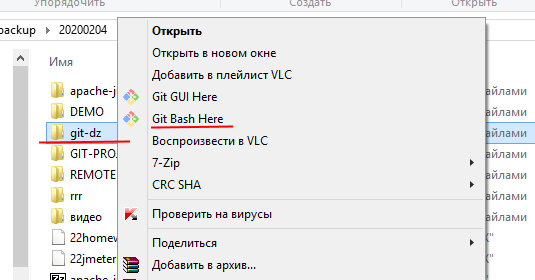

# Внедрение системы контроля версий
## Домашнее задание

### Задача 1


1. Зарегистрироваться на GitHub вам поможет [инструкция по регистрации на GitHub](https://github.com/netology-code/guides/tree/master/github) 

1. Затем потребуется установка GIT на компьютер. Как это сделать, подробно описано в 
[инструкции по установке GIT](https://github.com/netology-code/guides/blob/master/git/REAMDE.md)

1. Откройте терминал GIT в выбранной папке. Для этого кликните на ней правой кнопкой и выполните пункт "Git Bash Here", как показано на рисунке:



4. Создайте клон репозитория на своем компьютере. Для этого откройте терминал в выбранном каталоге и выполните код:
```
$ git clone https://github.com/sergsemenov/neurostartup1.git
```
5. Перейдите в создавшийся каталог репозитория командой cd
```
$ cd neurostartup1
```

Теперь репозиторий доступен для локальной работы с ним.

Успешной работы!
